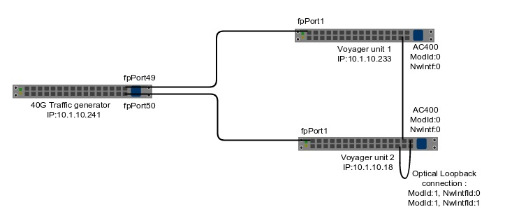

Voyager Test Setup
==================

**Description**

  The diagram above depicts the Voyager testbed setup. The testbed utilizes a 40G switch as a traffic source.
  Voyager unit 1 and Voyager unit 2 have, AC400 module 0, NW interface id 0 connected to each other.

  Given the above topology, bidirectional traffic flows can be setup originating from port 49/50 on the traffic
  generator, switched by the Voyager units 1/2 and terminating at the traffic generator.

  The test setup also provides for running traffic loopback tests. Voyager unit 2 has network interfaces 0 and 1
  looped back on AC400 module 1.
